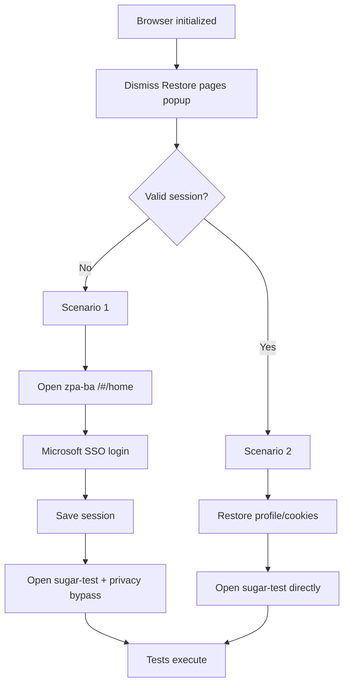

# Initial Setup — Scenario 1 / Scenario 2

This document describes the **pre-test initialization workflow**. These steps are **not a test case**.

Implementation: [`core/session_orchestrator.py`](../core/session_orchestrator.py)

## Initial Check

After the browser is initialized:

1. Dismiss Chrome **Restore pages?** popup (if shown)
2. Probe whether a **valid authenticated session** already exists
3. Route to **Scenario 2** if valid, otherwise **Scenario 1**

Session validity is checked by restoring the Chrome profile/cookies and opening **sugar-test** directly. If Microsoft login is not required, the session is valid.

## Scenario 1 — No valid session (first run / expired session)

| Step | Action |
|---|---|
| 1 | Navigate to `https://zpa-ba.credaris.ch/#/home` |
| 2 | Complete **Microsoft SSO login** (+ Authenticator MFA if prompted) |
| 2a | If **Pick an account** appears, click the configured user tile, then enter password |
| 3 | **Save session** to Chrome profile + `sessions/credaris_cookies.json` |
| 4 | Navigate to `https://sugar-test.intern.credaris.ch/` |
| 5 | Click **Advanced** → **Proceed to sugar-test.intern.credaris.ch (unsafe)** if privacy error shown |
| 6 | Wait until sugar-test is fully loaded |

## Scenario 2 — Valid session exists

| Step | Action |
|---|---|
| 1 | **Restore** saved session (Chrome profile + cookies) |
| 2 | **Skip** `zpa-ba.credaris.ch` — do not navigate to auth portal |
| 3 | Navigate **directly** to `https://sugar-test.intern.credaris.ch/` |
| 4 | Privacy bypass **only if** the warning still appears |
| 5 | Wait until sugar-test is fully loaded |

If Scenario 2 detects an expired session (Microsoft login redirect), the framework falls back to Scenario 1 automatically.

## Flow diagram



## Configuration

```properties
auth.base.url=https://zpa-ba.credaris.ch
auth.home.path=/#/home
application.url=https://sugar-test.intern.credaris.ch
application.host=sugar-test.intern.credaris.ch
```

## Pytest usage

All session fixtures delegate to one orchestrator run per pytest session:

```python
def test_example(self, application_ready):
    assert application_ready.is_ready()
```

Fixtures: `application_ready`, `prepared_app`, `authenticated_session`, `initial_setup_complete`

`tests/setup/test_home_setup.py` only **verifies** setup completed — it does not define the workflow.
