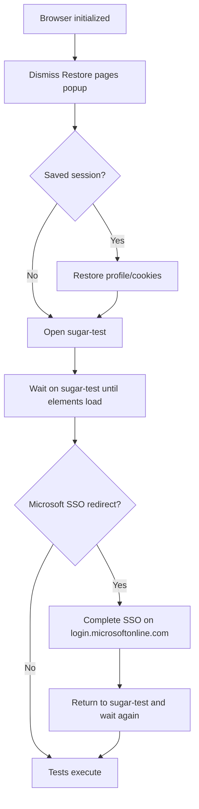

# Initial Setup — sugar-test only

This document describes the **pre-test initialization workflow**. These steps are **not a test case**.

Implementation: [`core/session_orchestrator.py`](../core/session_orchestrator.py)

## Flow

After the browser is initialized:

1. Dismiss Chrome **Restore pages?** popup (if shown)
2. **Restore** saved session when `reuse.session=true` and profile/cookies exist
3. Open **`https://sugar-test.intern.credaris.ch/`** directly — **do not** navigate to `zpa-ba.credaris.ch`
4. If already on sugar-test with a loading screen, **stay on that page** and wait for elements to load
5. Click **Advanced** → **Proceed to sugar-test.intern.credaris.ch (unsafe)** only if a privacy warning appears
6. Wait until sugar-test overlays/loaders clear and the app shell is visible
7. If sugar-test redirects to **Microsoft SSO**, complete login there (still no zpa-ba)
8. Save session to Chrome profile + `sessions/credaris_cookies.json` when reuse is enabled
9. Run Sugar login prerequisite, then module tests

## Flow diagram



## Configuration

```properties
application.url=https://sugar-test.intern.credaris.ch
application.host=sugar-test.intern.credaris.ch
reuse.session=true
sugar.load.timeout=120
keep.browser.open=true
```

## Pytest usage

All session fixtures delegate to one orchestrator run per pytest session:

```python
def test_example(self, application_ready):
    assert application_ready.is_ready()
```

Fixtures: `application_ready`, `prepared_app`, `authenticated_session`, `initial_setup_complete`

`tests/setup/test_home_setup.py` only **verifies** setup completed — it does not define the workflow.
